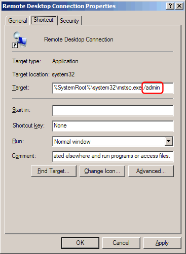
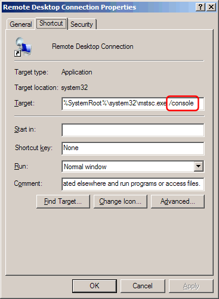
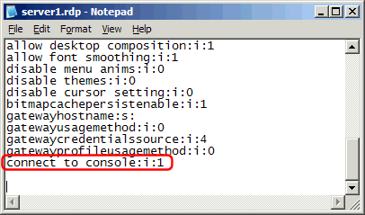

# Tray icon missing / cannot access Simple Failover UI through Remote Desktop / RDP

> [!Note] This article is specific to **Simple Failover v. 1.x**  
>The issues discussed here do **not** apply to Simple Failover v. 2.0 and later.

When you connect to a remote Windows Server using Terminal Services, you are accessing a new "user session" rather than the "console session".
(The console session is the desktop/screen that the user connected directly to the server with monitor/keyboard is seeing)  

When run as an Windows Service (NT-service), Simple Failover (and its tray icon) "lives" in the console session, and is therefore not directly accessible through Terminal Services.  

### Remote controlling Windows Server 2003

To access the Simple Failover main dialog through a Terminal Services session:

Using Remote Desktop client v. 6.1 or later (Windows XP SP3, Windows Vista SP1, Windows Server 2008).
Add the option " /admin" to the shortcut-target and click "OK":

Using Remote Desktop client v. 6.0 or earlier. Add the option " /console" to the shortcut-target and click "OK".  

For details on the difference between /console and /admin [click here](http://blogs.msdn.com/ts/archive/2007/12/17/changes-to-remote-administration-in-windows-server-2008.aspx).

If you connect to the remote server with a saved RDP file, then you can add an option string to the file, that specifies the session opens in the console.  
Open the RDP file with Notepad and add the option "connect to console:i:1" to the file and save.  

NOTE: Adding this to the RDP file does NOT work with Remote Desktop client v. 6.1 (Windows XP SP3, Windows Vista SP1, Windows Server 2008) - use /admin option instead - see above.  

### Remote controlling Windows 2000 Server

To temporarily access the Simple Failover main dialog through a Terminal Services session:

- Stop the Simple Failover service through the Control Panel / Services applet.  
- Open the "sfo.config.xml" file (in the directory where Simple Failover is installed) with Notepad and change "WinService" to "False" and save the file.  
- Run "sfo.exe".  
- When done making changes etc., exit the program again.  
- Open the "sfo.config.xml" file and change "WinService" back to "True" and save.  
- Start the Simple Failover service through the Control Panel / Services applet.  

As an alternative you can disable the "Run as Windows service" option (Options / General tab dialog), log in through Terminal Services, and run Simple Failover as a standard program.  
Simple Failover will keep running as long as your don't log-off the session.  
When leaving the Terminal Services session - do not log-off, but just close the session window or choose "disconnect" from the Shutdown dialog.  
The next time you login with the same username, you will connect to the same session.  

### Remote controlling Windows XP Professional
 
Above does not apply if the computer you connect to is running Windows XP Professional. With that version of Terminal Server ("Remote Desktop") you always connect to the console desktop - and the Simple Failover tray icon.  

NOTE: Other remote control programs such as [pcAnywhere](http://www.symantec.com/home_homeoffice/products/remote_pc_fax/pca115/index.html) and [RealVNC](http://www.realvnc.com/) do connect to the console session, and lets you access Simple Failover as if you were at the server computer no matter which Windows version you connect to.